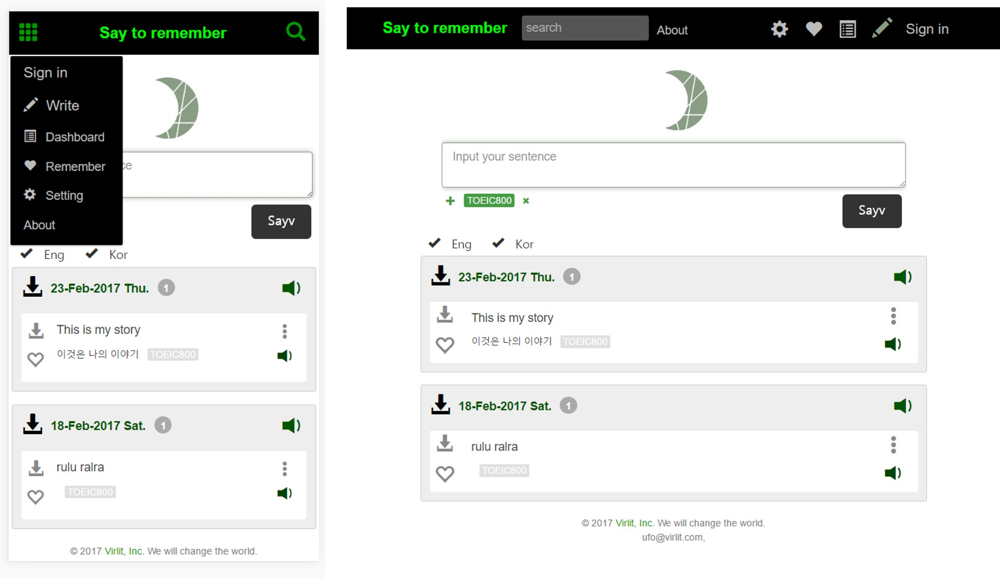

<h1 align="center"> Say To Remember </h1>

<div align="center">
  <a href='https://str.himion.com/'>https://str.himion.com</a>
  <div style='margin:20px;'> </img> </div>
  <em> 영어 듣기 특화 웹서비스</em>
</div>

## Screenshot


## Summary
1. 영어 문장을 입력하면 그것을 음성파일로 바꾸고 번역한 후 개인페이지에 저장합니다
2. 문장들을 기록하고 반복해 들으며 학습합니다
3. 영어 문장 혹은 번역 문장을 숨겨 눈으로 문장을 읽지 않고 귀로만 들으며 확인이 가능합니다 개별 문장을 터치하면 해당 문장을 숨기거나 보이게 할수 있습니다.

## 서비스 연혁
<div>
2017.11.xx <span style='margin-left:10px;'>MVP 제작 </span></br>
2018.04.11 <span style='margin-left:10px;'>본개발 제작 </span></br>
2018.09.22 <span style='margin-left:10px;'>서비스 시작</span></br>
</div>

## 사업후기
당시에는 나를 훌륭한 개발자라고 생각했다. 처음부터 끝까지 무언가를 만드는 것도 벌써 두번째였다. 지금처럼 파파고나 구글 번역이 좋지 않던 시절이었다. 

돈을 벌지 못하는 개발이 지긋지긋했던 나는 뜬금없이 영어 공부에 빠져있었다. 내가 개발을 잘할 수 있게 된 방법론을 영어에 적용해 보고 싶었다. 돌이켜보건데 둘다 결과가 별로였던 건 이렇게 필연적이었다. 

그럼에도 이 서비스의 아이디어는 나쁘지 않다고 생각한다. 나처럼 숫자 듣기에 약한 사람이나 나만의 특정 상황을 훈련해야 하는 사람이라면 그런 문장들을 집중적으로 반복해 듣고 익힐 수 있기 때문이다. 물론 나는 여전히 영어 숫자 듣기에 약하다. 그러니 이 서비스의 신뢰 여부는 내 판단을 넘어선다.


## 외부 라이브러리
1. 음성 | <a href='https://www.ncloud.com/product/aiService/csr'>CLOVA Speech Recognition</a> api키 필요
1. 번역 | <a href='https://developers.naver.com/docs/papago/papago-nmt-overview.md'>파파고 api</a> api키 필요
1. 음성 파일 저장 | <a href='https://aws.amazon.com/ko/'>AWS s3</a> 

## 기술스택
node.js, jQuery, bootstrap, jade, monogdb, aws s3

## Install
```bash
npm i
```
### MongoDB 
`sudo mongod --dbpath "몽고db 저장위치" --port "db 포트번호"`
```bash
sudo mongod --dbpath /database/SayToRemember --port 28028
```

## Run
```bash
node app
```

Then browse to `http://127.0.0.1:8888`

